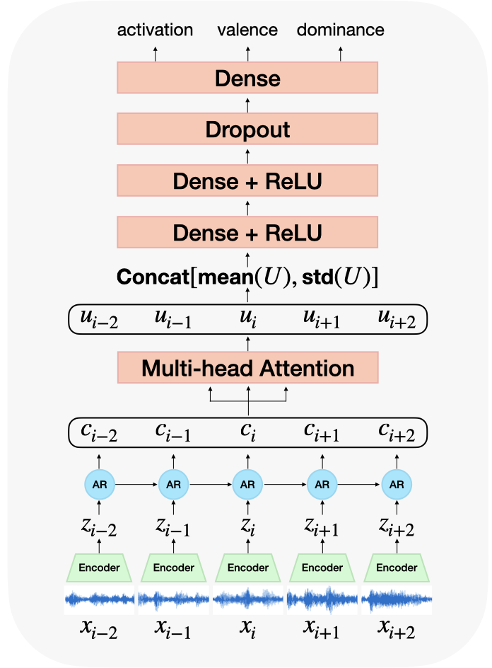

# CONTRASTIVE UNSUPERVISED LEARNING FOR SPEECH EMOTION RECOGNITION

This repository aims to provide more technical details of the paper
 
[CONTRASTIVE UNSUPERVISED LEARNING FOR SPEECH EMOTION RECOGNITION](http://)
 

### Quick description

### Datasets

### Experiments
